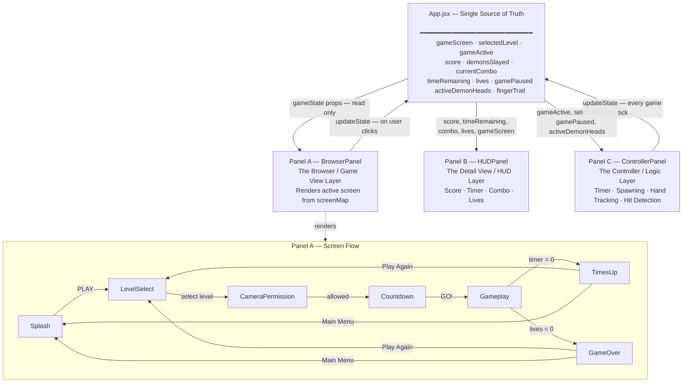

# Demon Slayer Hunters

**AI 201 — Project 2: The Reactive Sandbox**
**Bruna Stefani · Spring 2026**

A browser-based, camera-powered arcade game. Players use their real hand — tracked through the device camera via MediaPipe — to slice incoming demon heads before time runs out.

**Live URL:** [brunastefanii.github.io/DemonSlayerGame](https://brunastefanii.github.io/DemonSlayerGame/)

---

## The Three Panels

This project is built on a three-panel architecture sharing a single centralized state object in `App.jsx`. No component manages its own copy of the data.

| Panel | Role | Reads | Writes |
|-------|------|-------|--------|
| **Panel A — BrowserPanel** | Game View Layer. Renders the active screen based on `gameScreen` state. Never writes directly — only reacts. | `gameScreen`, `selectedLevel`, `gameActive`, `activeDemonHeads`, `fingerTrail` | nothing |
| **Panel B — HUDPanel** | Detail View / HUD Layer. Displays live score, timer, combo indicator, and lives. Reacts instantly to any state change. | `score`, `timeRemaining`, `currentCombo`, `demonsSlayed`, `lives`, `gameScreen` | nothing |
| **Panel C — ControllerPanel** | Input & Game Logic Layer. The only component that writes to shared state during active gameplay. Manages the game timer, demon spawning, movement, hand tracking, and slash detection. | `gameActive`, `selectedLevel`, `gamePaused`, `activeDemonHeads` | `score`, `demonsSlayed`, `currentCombo`, `timeRemaining`, `lives`, `activeDemonHeads`, `fingerTrail`, `gameScreen` |

---

## System Architecture — Mermaid Diagram



---

## Design Intent

Full PRD written before AI engagement: [`claude/docs/PRD_DemonSlayer.pdf`](claude/docs/PRD_DemonSlayer.pdf)

**Domain:** Gesture-based arcade game — hand tracking as the controller.

**Data model (state shape):**
```json
{
  "gameScreen": "splash",
  "selectedLevel": null,
  "cameraAllowed": null,
  "gameActive": false,
  "score": 0,
  "demonsSlayed": 0,
  "currentCombo": 0,
  "timeRemaining": 30,
  "lives": 3,
  "gamePaused": false,
  "activeDemonHeads": [],
  "fingerTrail": []
}
```

**Visual mood:** Dark K-pop idol aesthetic — deep purple-black backgrounds, neon red/purple accents, hexagonal UI geometry, Oswald typography, drop-shadow glow on all interactive elements.

**State flow:** User actions in BrowserPanel screens (PLAY, level select, camera allow) write `gameScreen` and `selectedLevel` up to `App.jsx`. ControllerPanel writes all gameplay values (score, lives, timer) in real time. HUDPanel and BrowserPanel both react immediately to those changes.

---

## AI Direction Log

Full log with 21 entries: [`claude/checkpoints/AI-Direction-Log.md`](claude/checkpoints/AI-Direction-Log.md)

**Selected entries demonstrating editorial judgment:**

**Entry 8 — Hand Tracking Architecture**
Asked AI to add MediaPipe Hands integration. It used a standard `useEffect` ref pattern. I kept it but required all WASM loaded from CDN to avoid Vite bundling issues — AI initially attempted local bundling which broke the build.

**Entry 13 — Splash Screen**
Asked AI to implement the splash screen from a background image. It initially used `background-size: cover` which cropped the bottom of the image. I identified the image was 3:2 ratio on a 16:9 screen and directed it to use `contain` instead. Then the PLAY button overlapped the SLAY text in the art — I directed the fix to `position: absolute; bottom: 12%`.

**Entry 18 — Virtual Background Segmentation**
Asked AI to add virtual background (player visible, real background replaced). First version ran MediaPipe SelfieSegmentation at 60fps alongside the Hands model — the finger trail stopped working entirely. I identified the CPU contention problem and directed AI to throttle segmentation to every 4th frame (~15fps) and preload the model during countdown. That fixed it.

**Entry 19 — Game Over Screen**
Asked AI to build the Game Over screen. AI routed `lives = 0` to `gameScreen: 'timesUp'` — the wrong screen. I caught the routing bug and corrected it to `gameScreen: 'gameOver'` before it caused confusion in testing.

---

## Records of Resistance

Full log with 14 documented moments: [`claude/checkpoints/records-of-resistance.md`](claude/checkpoints/records-of-resistance.md)

**Three highlights:**

**RoR 4 — Full Visual Redesign Rejected**
AI produced a 5-part visual redesign based on a Figma inspiration image: deep purple-black background, neon magenta finger trail, magenta accents replacing all red, floating glass HUD with backdrop blur, and score popups. I rejected all of it. Saved a checkpoint documenting what was tried, then reverted all source files.
*Why:* Did not like any of the visual changes.

**RoR 5 — Wrong Revert Deleted Work**
After a failed level select implementation, I said "revert." AI used `git restore` on modified files AND `rm -rf` on new untracked files, permanently deleting `LevelCard.jsx`, `LevelCard.css`, and the entire `cards/` asset folder.
*Why:* "Revert" meant go back to the last stable state and try again — not destroy the new work. The correct move was to keep the files and fix the specific problem.

**RoR 12 — Segmentation Broke Finger Trail**
First version of `useBodySegmentation` ran a full rAF loop at 60fps. The finger trail stopped working. I directed the fix: throttle to every 4th frame and add a singleton preloader.
*Why:* Running both MediaPipe models at full framerate saturated the CPU, starving the hand tracking.

---

## Five Questions Reflection

<!-- BRUNA — paste your five answers here before submitting -->

**1. Can I defend this?**

**2. Is this mine?**

**3. Did I verify?**

**4. Would I teach this?**

**5. Is my documentation honest?**

---

## Project Structure

```
src/
├── App.jsx                          # Centralized state (single source of truth)
├── components/
│   ├── panels/
│   │   ├── BrowserPanel.jsx         # Panel A — renders active screen
│   │   ├── HUDPanel.jsx             # Panel B — live score/timer/combo/lives
│   │   └── ControllerPanel.jsx      # Panel C — game logic, hand tracking
│   ├── screens/
│   │   ├── SplashScreen.jsx
│   │   ├── LevelSelect.jsx
│   │   ├── CameraPermission.jsx
│   │   ├── Countdown.jsx
│   │   ├── Gameplay.jsx
│   │   ├── TimesUp.jsx
│   │   └── GameOver.jsx
│   └── ui/
│       ├── DemonHead.jsx            # Living demon + slay animation
│       ├── FingerTrail.jsx          # Bezier sword trail with glow
│       └── SoundToggle.jsx          # Persistent mute button
├── hooks/
│   ├── useHandTracking.js           # MediaPipe Hands — fingertip position
│   ├── useBodySegmentation.js       # MediaPipe SelfieSegmentation — virtual bg
│   └── useAudio.js                  # Web Audio API — all SFX + music
└── data/
    └── gameData.json                # Level configs + grade thresholds
```

---

## Checkpoints

| # | Date | Summary |
|---|------|---------|
| 01 | 2026-04-27 | Full build through Phase 5 — audio + slay animation |
| 02 | 2026-04-27 | Visual redesign attempt — all 5 changes rejected and reverted |
| 03 | 2026-04-28 | Splash screen background art + CSS PLAY button |
| 04 | 2026-04-28 | Level select attempt failed — bad revert deleted work |
| 05 | 2026-04-28 | Level select — background art, BACK button, three Figma cards |
| 06 | 2026-04-28 | Camera Permission screen — floating layout, ALLOW CAMERA button |
| 07 | 2026-04-29 | Countdown screen + CSS HUD panel with purple neon glow |
| 08 | 2026-04-29 | Gameplay screen — virtual background segmentation |
| 09 | 2026-04-29 | Lives system, sword trail glow, pause, combo scoring, demon images |
| 10 | 2026-04-29 | Game Over + Times Up screens — background art, score HUD, buttons |
| 11 | 2026-04-29 | Sound on/off toggle — master gain node, persistent all screens |
